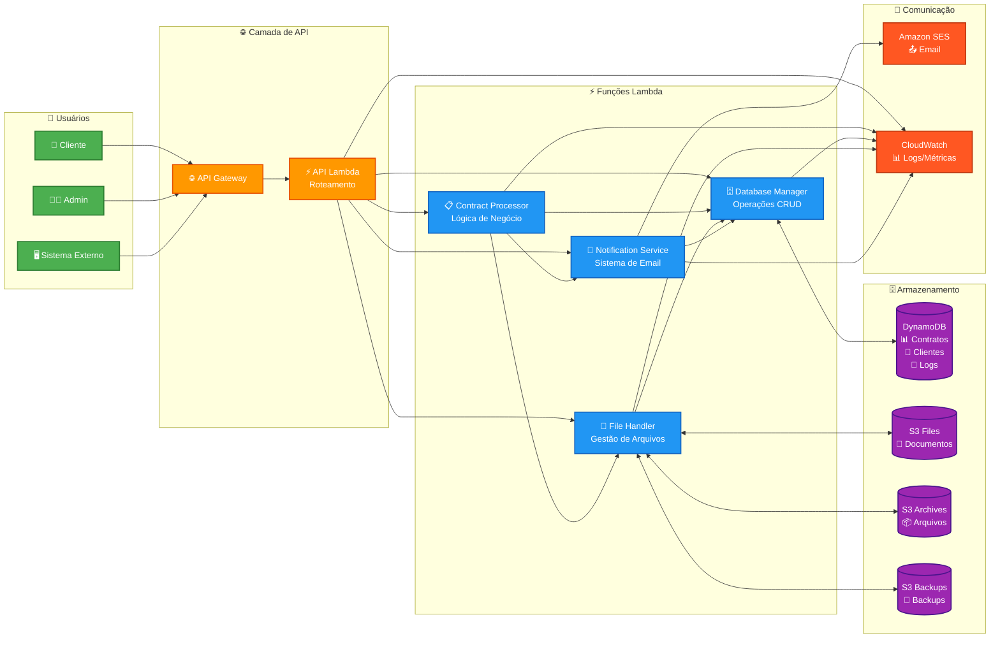
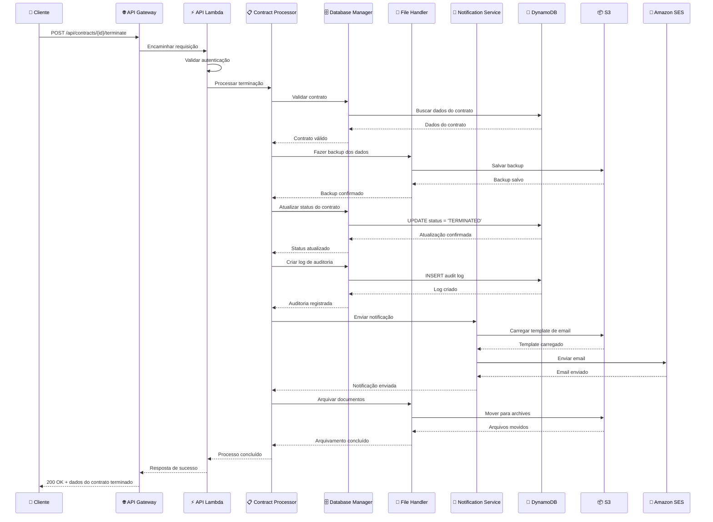

# 🏗️ TESTEX - Diagrama de Arquitetura AWS Lambda

## 📋 Componentes do Sistema

### 👥 **Camada de Usuários**
- **Cliente**: Usuários finais do sistema
- **Administrador**: Gestores do sistema
- **Sistema Externo**: Integrações de terceiros

### 🌐 **Camada de API** 
- **API Gateway**: Ponto de entrada único para todas as requisições
- **API Lambda**: Função de roteamento e validação de requisições

### ⚡ **Funções Lambda Core**
- **Contract Processor**: Lógica principal de negócio para contratos
- **Database Manager**: Todas as operações de banco de dados
- **File Handler**: Gestão de arquivos e documentos
- **Notification Service**: Sistema de notificações por email

### 🗄️ **Camada de Dados**
- **DynamoDB**: Base de dados NoSQL para contratos, clientes e logs
- **S3 Buckets**: Armazenamento de arquivos, backups e templates

### 📧 **Serviços de Comunicação**
- **Amazon SES**: Serviço de envio de emails
- **CloudWatch**: Monitoramento e logs do sistema

---

# 🔄 Fluxo de Terminação de Contrato

## 🎯 **Principais Benefícios da Arquitetura**

### ✅ **Escalabilidade**
- Auto-scaling das funções Lambda
- DynamoDB com capacidade sob demanda
- S3 com armazenamento ilimitado

### ✅ **Confiabilidade**
- Retry automático em caso de falhas
- Backup automático de dados críticos
- Logs detalhados para auditoria

### ✅ **Segurança**
- IAM roles com privilégios mínimos
- Criptografia em trânsito e em repouso
- Logs de auditoria completos

### ✅ **Custo-Efetivo**
- Pay-per-use em todas as camadas
- Sem infraestrutura para gerenciar
- Otimização automática de recursos

### ✅ **Manutenibilidade**
- Separação clara de responsabilidades
- Código modular e testável
- Monitoramento integrado