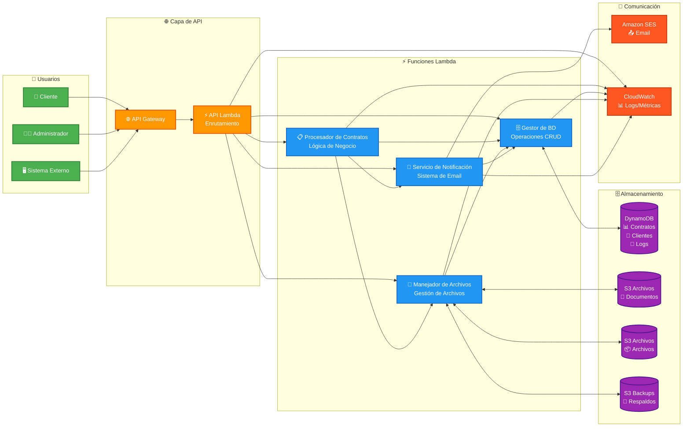
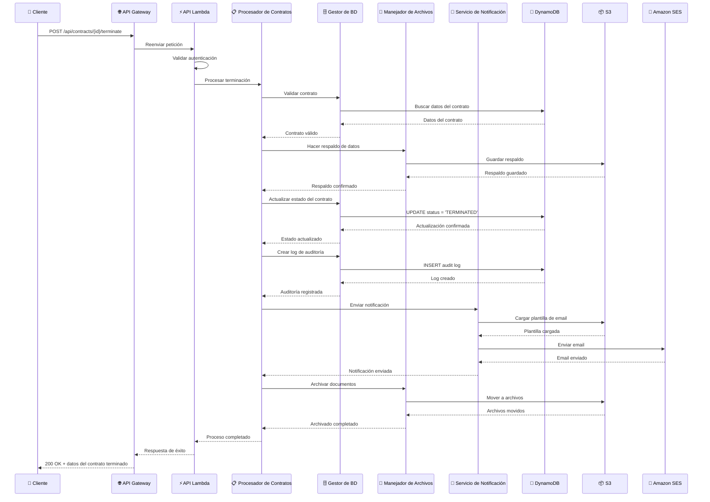

# 🏗️ TESTEX - Diagrama de Arquitectura AWS Lambda (Español)

## 📋 Componentes del Sistema

### 👥 **Capa de Usuarios**

- **Cliente**: Usuarios finales del sistema
- **Administrador**: Gestores del sistema
- **Sistema Externo**: Integraciones de terceros

### 🌐 **Capa de API**

- **API Gateway**: Punto de entrada único para todas las peticiones
- **API Lambda**: Función de enrutamiento y validación de peticiones

### ⚡ **Funciones Lambda Core**

- **Procesador de Contratos**: Lógica principal de negocio para contratos
- **Gestor de BD**: Todas las operaciones de base de datos
- **Manejador de Archivos**: Gestión de archivos y documentos
- **Servicio de Notificación**: Sistema de notificaciones por email

### 🗄️ **Capa de Datos**

- **DynamoDB**: Base de datos NoSQL para contratos, clientes y logs
- **S3 Buckets**: Almacenamiento de archivos, respaldos y plantillas

### 📧 **Servicios de Comunicación**

- **Amazon SES**: Servicio de envío de emails
- **CloudWatch**: Monitoreo y logs del sistema

---

# 🔄 Flujo de Terminación de Contrato

## 🎯 **Principales Beneficios de la Arquitectura**

### ✅ **Escalabilidad**

- Auto-escalado de las funciones Lambda
- DynamoDB con capacidad bajo demanda
- S3 con almacenamiento ilimitado

### ✅ **Confiabilidad**

- Reintento automático en caso de fallos
- Respaldo automático de datos críticos
- Logs detallados para auditoría

### ✅ **Seguridad**

- Roles IAM con privilegios mínimos
- Cifrado en tránsito y en reposo
- Logs de auditoría completos

### ✅ **Costo-Efectivo**

- Pago por uso en todas las capas
- Sin infraestructura que gestionar
- Optimización automática de recursos

### ✅ **Mantenibilidad**

- Separación clara de responsabilidades
- Código modular y testeable
- Monitoreo integrado