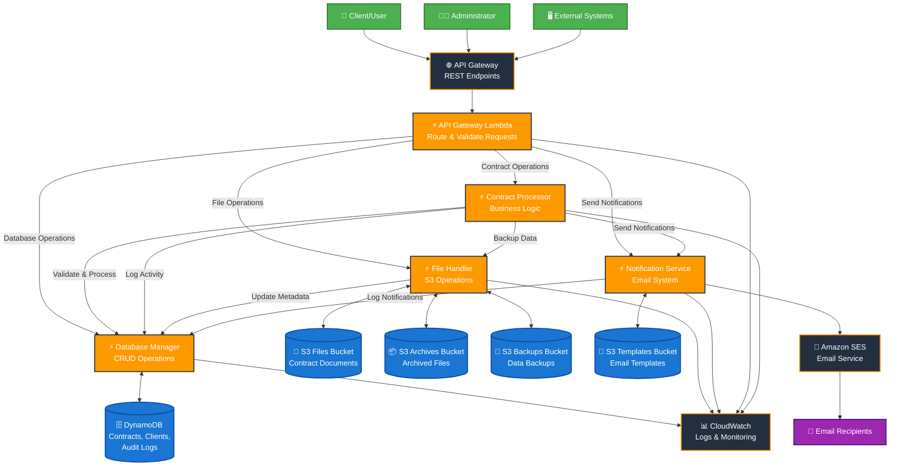

# TESTEX System Architecture Flowchart

## 🏗️ System Components Overview

### 📱 **User Interfaces**
- **Client/User**: End users accessing contract services
- **Administrator**: System administrators managing contracts
- **External Systems**: Third-party integrations

### 🌐 **API Layer**
- **API Gateway**: Main entry point for all requests
- **API Gateway Lambda**: Request routing and validation

### ⚡ **Core Lambda Functions**
1. **Contract Processor**: Main business logic for contract operations
2. **Database Manager**: All database CRUD operations
3. **File Handler**: File management and S3 operations
4. **Notification Service**: Email notifications and alerts

### 🗄️ **Data Storage**
- **DynamoDB**: NoSQL database for contracts, clients, and audit logs
- **S3 Buckets**: File storage, archives, backups, and email templates

### 📧 **Communication**
- **Amazon SES**: Email delivery service
- **CloudWatch**: Monitoring and logging

## 🔄 **Process Flows**

### 1. **Contract Termination Flow**
```
User Request → API Gateway → API Lambda → Contract Processor
                                          ↓
Database Update ← Database Manager ← Contract Processor
                                          ↓
File Backup ← File Handler ← Contract Processor
                                          ↓
Email Notification ← Notification Service ← Contract Processor
```

### 2. **File Management Flow**
```
File Upload → API Gateway → API Lambda → File Handler
                                         ↓
S3 Storage ← File Handler
                                         ↓
Metadata Update ← Database Manager ← File Handler
```

### 3. **Notification Flow**
```
Trigger Event → Notification Service
                     ↓
Load Template ← S3 Templates
                     ↓
Send Email → Amazon SES → Recipients
                     ↓
Log Activity → Database Manager
```

## 📊 **Data Flow Patterns**

### **Synchronous Operations**
- API Gateway → Lambda Functions
- Lambda Functions → DynamoDB
- Lambda Functions → S3

### **Asynchronous Operations**
- Email notifications via SES
- File backup operations
- Audit log creation

### **Cross-Function Communication**
- Contract Processor → Database Manager
- Contract Processor → File Handler
- Contract Processor → Notification Service
- File Handler → Database Manager
- Notification Service → Database Manager

## 🔐 **Security & Monitoring**

### **Access Control**
- IAM roles for each Lambda function
- Least privilege access to AWS services
- API Gateway authorization

### **Monitoring & Logging**
- All Lambda functions → CloudWatch Logs
- DynamoDB metrics → CloudWatch
- S3 access logging
- SES delivery notifications

## 🚀 **Scalability Features**

### **Auto-scaling**
- Lambda functions scale automatically
- DynamoDB on-demand billing
- S3 unlimited storage capacity

### **Performance Optimization**
- Shared Lambda layers for common dependencies
- DynamoDB Global Secondary Indexes
- S3 lifecycle policies for cost optimization

This flowchart represents the complete TESTEX AWS Lambda system architecture, showing how all components interact to provide a robust, scalable contract termination solution.