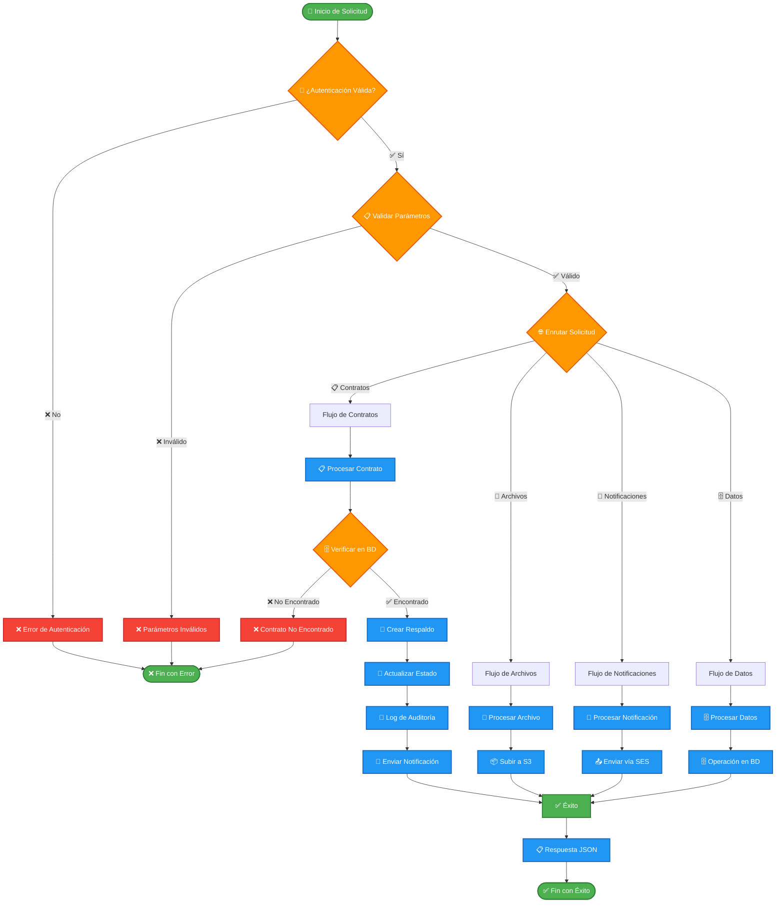
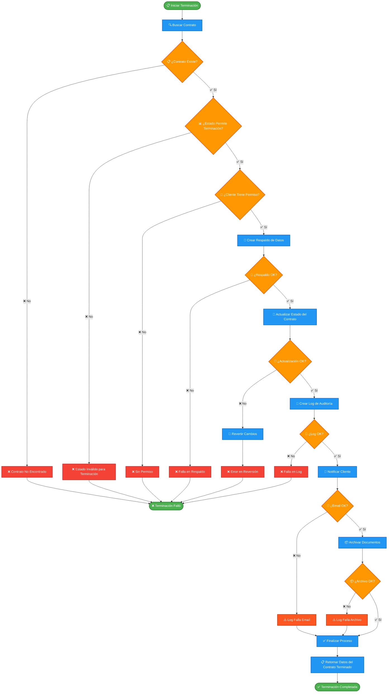

# 🔄 TESTEX - Diagrama de Flujo del Sistema (Español)

Sistema completo de terminación de contratos automatizado usando AWS Lambda.

## 🏗️ Arquitectura General del Sistema

## 📋 Detalle de los Componentes

### 🔐 **Capa de Autenticación**

- Validación de tokens JWT
- Verificación de permisos
- Limitación de tasa

### 📋 **Procesamiento de Contratos**

- Validación de datos del contrato
- Verificación de estado actual
- Aplicación de reglas de negocio

### 💾 **Gestión de Datos**

- Operaciones CRUD en DynamoDB
- Respaldo automático de datos críticos
- Log de auditoría completo

### 📁 **Gestión de Archivos**

- Subida segura a S3
- Validación de tipos de archivo
- Control de versionado

### 📧 **Sistema de Notificaciones**

- Plantillas de email personalizables
- Envío vía Amazon SES
- Seguimiento de entrega

---

# 🔄 Flujo Específico de Terminación de Contrato

## 📊 **Métricas y Monitoreo**

### 📈 **KPIs Principales**

- Tasa de éxito de terminaciones
- Tiempo promedio de procesamiento
- Número de rollbacks necesarios
- Tasa de entrega de emails

### 🚨 **Alertas Configuradas**

- Fallos consecutivos > 3
- Tiempo de respuesta > 30s
- Uso de memoria > 80%
- Errores de permiso > 10/min

### 📝 **Logs Detallados**

- Timestamp de cada operación
- ID de transacción única
- Datos de entrada/salida
- Stack trace de errores

---

## 🔒 **Seguridad y Cumplimiento**

### 🛡️ **Controles de Seguridad**

- Autenticación obligatoria
- Autorización basada en roles
- Cifrado en tránsito y reposo
- Auditoría completa de operaciones

### 📋 **Cumplimiento**

- Cumplimiento LGPD/GDPR
- Rastro de auditoría SOX
- Retención de logs por 7 años
- Respaldo geográfico distribuido

### 🔐 **Control de Acceso**

- Principio del menor privilegio
- MFA obligatorio para admins
- Rotación automática de claves
- Segregación de entornos