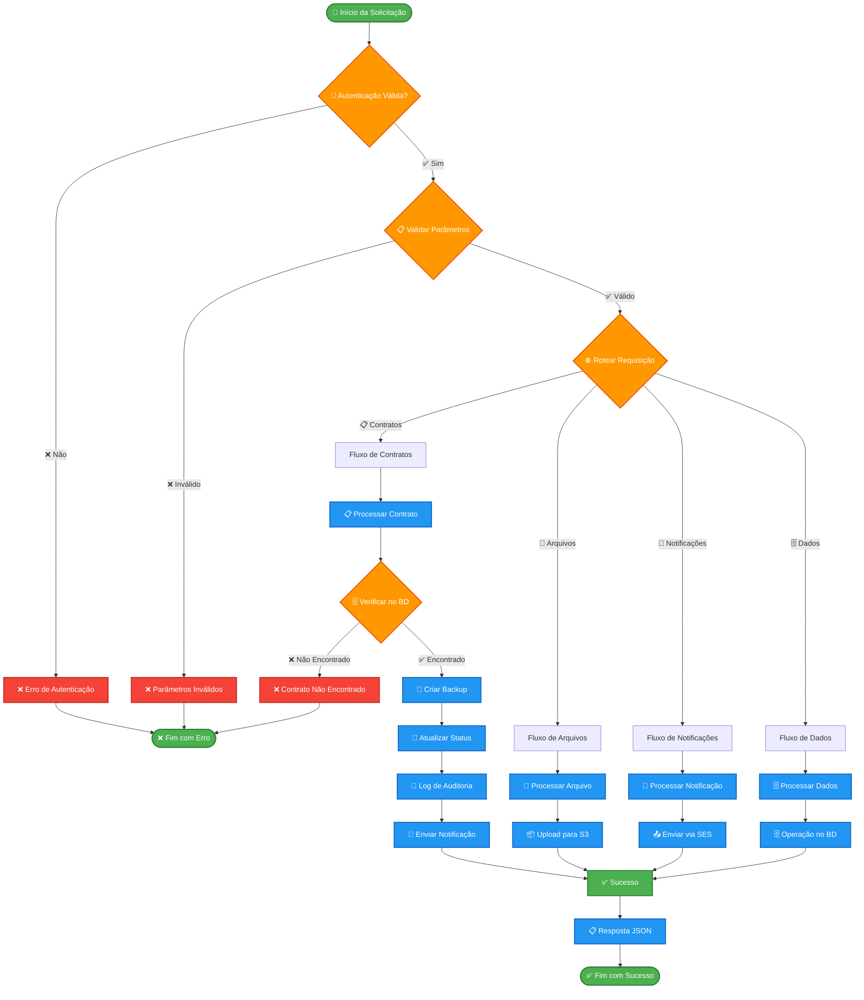
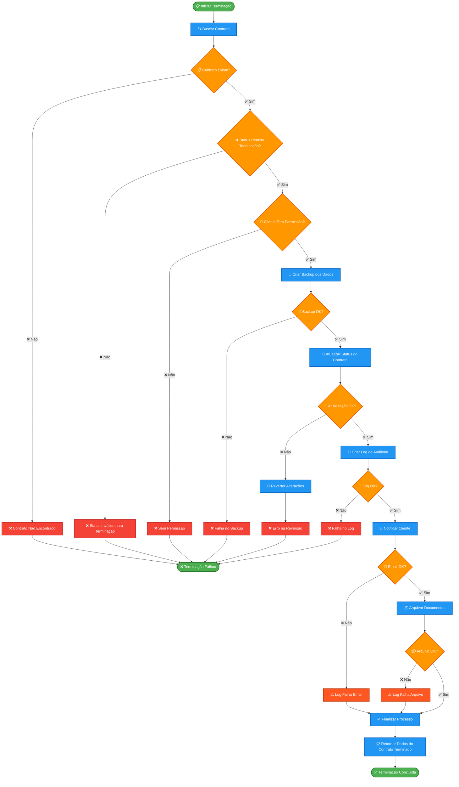

# 🔄 TESTEX - Fluxograma do Sistema (Português)

Sistema completo de terminação de contratos automatizado usando AWS Lambda.

## 🏗️ Arquitetura Geral do Sistema

## 📋 Detalhamento dos Componentes

### 🔐 **Camada de Autenticação**
- Validação de tokens JWT
- Verificação de permissões
- Rate limiting

### 📋 **Processamento de Contratos**
- Validação de dados do contrato
- Verificação de status atual
- Aplicação de regras de negócio

### 💾 **Gestão de Dados**
- Operações CRUD no DynamoDB
- Backup automático de dados críticos
- Log de auditoria completo

### 📁 **Gestão de Arquivos**
- Upload seguro para S3
- Validação de tipos de arquivo
- Controle de versioning

### 📧 **Sistema de Notificações**
- Templates de email personalizáveis
- Envio via Amazon SES
- Tracking de entrega

---

# 🔄 Fluxo Específico de Terminação de Contrato

## 📊 **Métricas e Monitoramento**

### 📈 **KPIs Principais**
- Taxa de sucesso de terminações
- Tempo médio de processamento
- Número de rollbacks necessários
- Taxa de entrega de emails

### 🚨 **Alertas Configurados**
- Falhas consecutivas > 3
- Tempo de resposta > 30s
- Uso de memória > 80%
- Erros de permissão > 10/min

### 📝 **Logs Detalhados**
- Timestamp de cada operação
- ID da transação única
- Dados de entrada/saída
- Stack trace de erros

---

## 🔒 **Segurança e Conformidade**

### 🛡️ **Controles de Segurança**
- Autenticação obrigatória
- Autorização baseada em roles
- Criptografia em trânsito e repouso
- Auditoria completa de operações

### 📋 **Conformidade**
- LGPD/GDPR compliance
- SOX audit trail
- Retenção de logs por 7 anos
- Backup geográfico distribuído

### 🔐 **Controle de Acesso**
- Princípio do menor privilégio
- MFA obrigatório para admins
- Rotação automática de chaves
- Segregação de ambientes